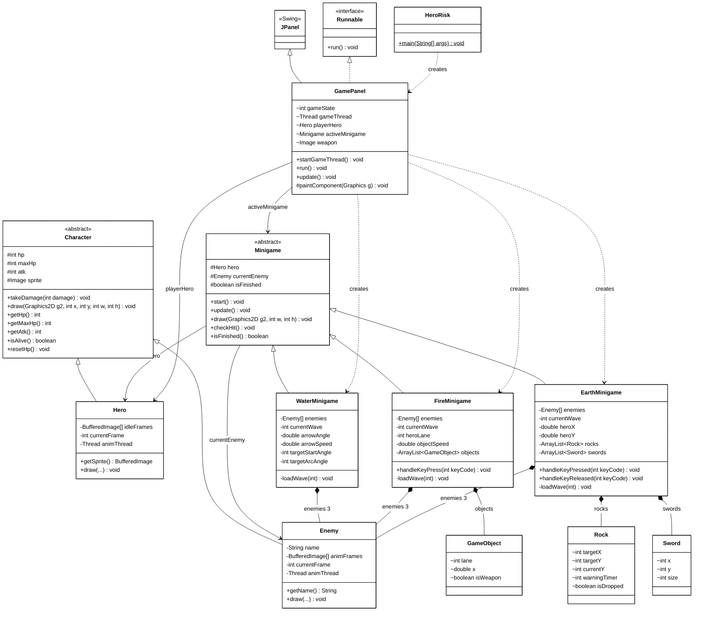

# Hero Risk - Class Diagram

```mermaid
%%{init: {
  'theme': 'base',
  'themeVariables': {
    'background': '#ffffff',
    'primaryColor': '#ffffff',
    'secondaryColor': '#ffffff',
    'tertiaryColor': '#ffffff',
    'mainBkg': '#ffffff',
    'primaryTextColor': '#000000',
    'textColor': '#000000',
    'classText': '#000000',
    'primaryBorderColor': '#000000',
    'nodeBorder': '#000000',
    'lineColor': '#000000',
    'edgeLabelBackground': '#ffffff'
  }
}}%%
classDiagram
  direction TB

  class Character {
    <<abstract>>
    #int hp
    #int maxHp
    #int atk
    #Image sprite
    +takeDamage(int damage) void
    +draw(Graphics2D g2, int x, int y, int w, int h) void
    +getHp() int
    +getMaxHp() int
    +getAtk() int
    +isAlive() boolean
    +resetHp() void
  }

  class Hero {
    -BufferedImage[] idleFrames
    -int currentFrame
    -Thread animThread
    +getSprite() BufferedImage
    +draw(...) void
  }

  class Enemy {
    -String name
    -BufferedImage[] animFrames
    -int currentFrame
    -Thread animThread
    +getName() String
    +draw(...) void
  }

  class Minigame {
    <<abstract>>
    #Hero hero
    #Enemy currentEnemy
    #boolean isFinished
    +start() void
    +update() void
    +draw(Graphics2D g2, int w, int h) void
    +checkHit() void
    +isFinished() boolean
  }

  class WaterMinigame {
    -Enemy[] enemies
    -int currentWave
    -double arrowAngle
    -double arrowSpeed
    -int targetStartAngle
    -int targetArcAngle
    -loadWave(int) void
  }

  class FireMinigame {
    -Enemy[] enemies
    -int currentWave
    -int heroLane
    -double objectSpeed
    -ArrayList~GameObject~ objects
    +handleKeyPress(int keyCode) void
    -loadWave(int) void
  }

  class EarthMinigame {
    -Enemy[] enemies
    -int currentWave
    -double heroX
    -double heroY
    -ArrayList~Rock~ rocks
    -ArrayList~Sword~ swords
    +handleKeyPressed(int keyCode) void
    +handleKeyReleased(int keyCode) void
    -loadWave(int) void
  }

  class GameObject {
    ~int lane
    ~double x
    ~boolean isWeapon
  }

  class Rock {
    ~int targetX
    ~int targetY
    ~int currentY
    ~int warningTimer
    ~boolean isDropped
  }

  class Sword {
    ~int x
    ~int y
    ~int size
  }

  class GamePanel {
    ~int gameState
    ~Thread gameThread
    ~Hero playerHero
    ~Minigame activeMinigame
    ~Image weapon
    +startGameThread() void
    +run() void
    +update() void
    #paintComponent(Graphics g) void
  }

  class HeroRisk {
    +main(String[] args)$ void
  }

  class JPanel {
    <<Swing>>
  }

  class Runnable {
    <<interface>>
    +run() void
  }

  Character <|-- Hero
  Character <|-- Enemy
  Minigame <|-- WaterMinigame
  Minigame <|-- FireMinigame
  Minigame <|-- EarthMinigame
  Minigame --> Hero : hero
  Minigame --> Enemy : currentEnemy
  WaterMinigame *-- Enemy : enemies 3
  FireMinigame *-- Enemy : enemies 3
  EarthMinigame *-- Enemy : enemies 3
  FireMinigame *-- GameObject : objects
  EarthMinigame *-- Rock : rocks
  EarthMinigame *-- Sword : swords
  JPanel <|-- GamePanel
  Runnable <|.. GamePanel
  GamePanel --> Hero : playerHero
  GamePanel --> Minigame : activeMinigame
  GamePanel ..> WaterMinigame : creates
  GamePanel ..> FireMinigame : creates
  GamePanel ..> EarthMinigame : creates
  HeroRisk ..> GamePanel : creates
```
